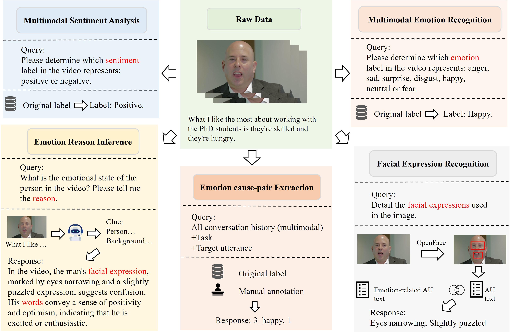
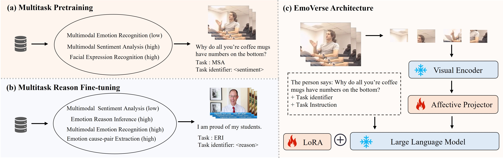

#  EmoVerse: Exploring Multimodal Large Language Models for Sentiment and Emotion Understanding

**Ao Li***, **Longwei Xu***, **Chen Ling**, **Jinghui Zhang**, **Pengwei Wang**†

- *Equal contribution  
- †Corresponding author

Our paper: [arXiv](https://arxiv.org/abs/2412.08049).

## Affective Multitask Dataset (AMT Dataset)
we construct the Affective Multitask (AMT) dataset, which includes multimodal sentiment analysis (MSA), multimodal emotion recognition (MER), facial expression recognition (FER), emotion reasoning inference (ERI), and emotion cause-pair extraction (ECPE) tasks. 

<div align="center">
  
</div>

We provide the training data for both stages of EmoVerse, which can be found in the data folder.

- **Multitask Pretraining**: The files are based on randomly sampled tasks from the **MOSEI** dataset.
- **Multitask Reason Fine-tuning**: The files are based on mixed sampling from three different datasets and various tasks.

Please donwload raw video:
- For the **MOSEI** dataset, download the video from [here](https://github.com/thuiar/MMSA).
- For the **MELD** dataset, download the video from [here](https://github.com/declare-lab/MELD).
- For the **ECF2.0** dataset, download the dataset from [here](https://github.com/NUSTM/SemEval-2024_ECAC/tree/main/data).

## EmoVerse
We develop the EmoVerse model. EmoVerse unifies tasks in the sentiment and emotion domains by leveraging the M2SE strategy.

<div align="center">
  
</div>

### Environment
The fine-tuning framework for EmoVerse based on ms-swift: [ms-swift](https://github.com/modelscope/ms-swift).
```
conda create -n emoverse python=3.9
conda activate emoverse
pip install 'ms-swift[all]' -U
```

### Checkpoint
EmoVerse is fine-tuned based on Internvl2, download Internvl2 weights at [here](https://github.com/OpenGVLab/InternVL).
Once the checkpoint is downloaded, place it in your own directory and make sure to update the model path in the corresponding .sh file accordingly. 
We will be releasing the EmoVerse checkpoint soon.

### Multitask Pretraining
```
bash first_stage.sh
```

### Multitask Reason Fine-tuning
```
bash second_stage.sh
```

### Evaluation
Once inference is completed using ms-swift, the corresponding inference files will be generated. You can then calculate the accuracy by using the functions in compute_result.py.
```
bash test.sh
python compute_result.py
```

## Cite us
```
@misc{li2025emoverseexploringmultimodallarge,
      title={EmoVerse: Exploring Multimodal Large Language Models for Sentiment and Emotion Understanding}, 
      author={Ao Li and Longwei Xu and Chen Ling and Jinghui Zhang and Pengwei Wang},
      year={2025},
      eprint={2412.08049},
      archivePrefix={arXiv},
      primaryClass={cs.CL},
      url={https://arxiv.org/abs/2412.08049}, 
}
```
